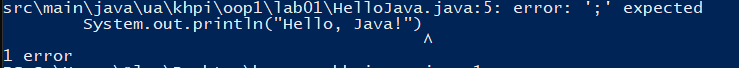
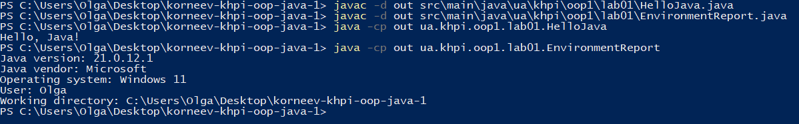
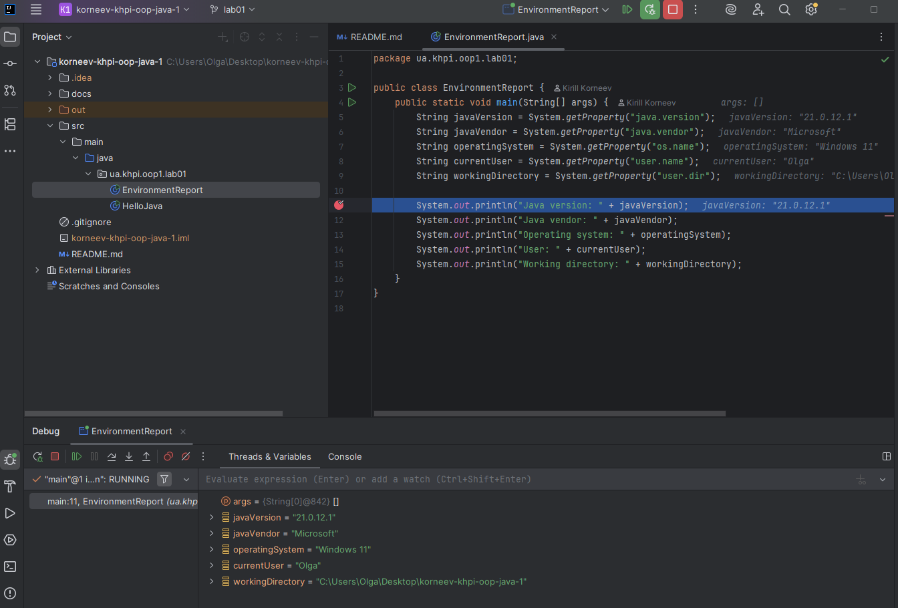
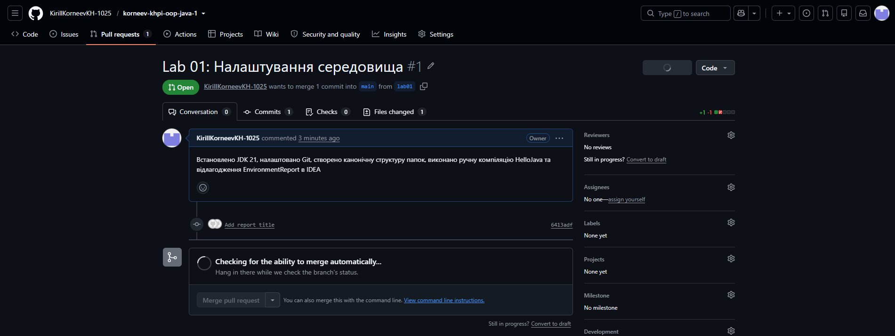

# Звіт з лабораторної роботи № 1
- **Тема:** Налаштування середовища та перша Java-програма
- **Виконав:** Корнєєв Кирилл Андрійович, КН-1025
- **Викладач:** Оксана Василівна Мнушка,Володимир Миколайович Савченко
- **Місто:** Харків
- **Рік:** 2026

## Налаштування середовища
| Компонент | Версія |
|---|---|
| ОС | Windows 11 |
| JDK | Microsoft OpenJDK 21.0.12.1 |
| Git | 2.55.0.windows.3 |
| IntelliJ IDEA | Community Edition |

- **Репозиторій:** https://github.com/KirillKorneevKH-1025/korneev-khpi-oop-java-1
- **Гілка:** `lab01`
- **Pull Request:** https://github.com/KirillKorneevKH-1025/korneev-khpi-oop-java-1/pull/1

## Мета
Опанування відтворюваного циклу розроблення Java-програми: налаштування середовища Java SE 21, ручна компіляція і запуск, робота з IntelliJ IDEA та публікація результату на GitHub через Pull Request.

## Структура класів
- **Дерево каталогів:** `src/main/java/ua/khpi/oop1/lab01/`
- **Класи:** `HelloJava` (виведення привітання), `EnvironmentReport` (виведення інформації про систему).

## Тестування і визначення набору даних
**Помилка компіляції:**

**Ручна компіляція та запуск:**

**Налагодження в IntelliJ IDEA (Debug):**

**Відкритий Pull Request:**

## Висновки
Під час виконання роботи було налаштовано базове середовище розробки, засвоєно принципи компіляції вихідного коду (.java) у байткод (.class) та його виконання за допомогою JVM. Також опановано базовий процес версіонування за допомогою Git.
