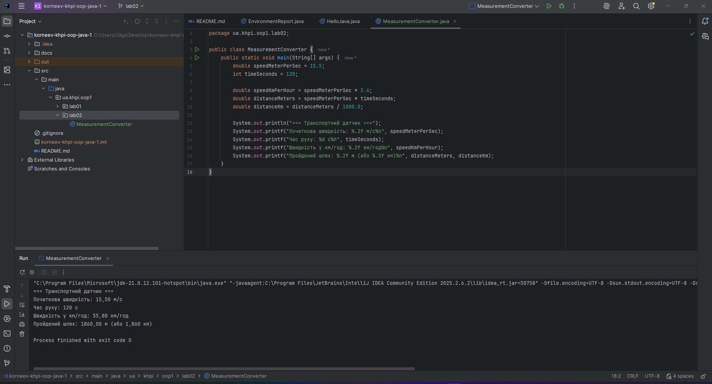
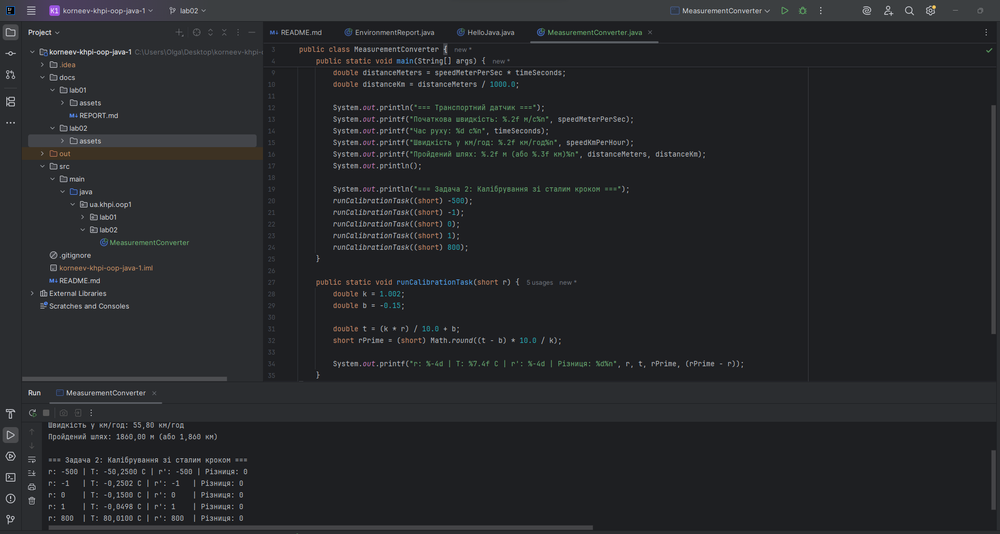
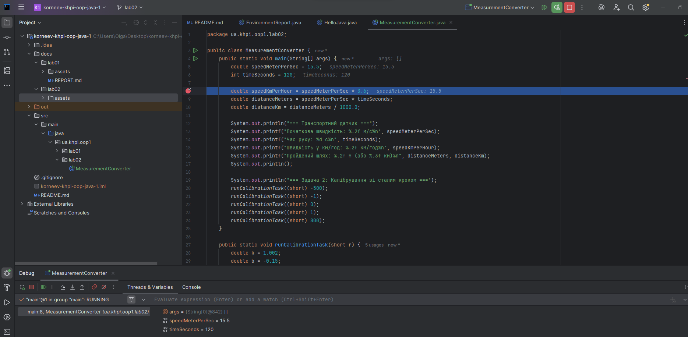

# Звіт з лабораторної роботи № 2

**Тема:** Типи даних, літерали та перетворення
**Виконав:** Корнєєв Кирилл, група КН-1025
**Варіант:** 2

## Мета
Побудова відтворюваної Java-програми для перетворення інженерних величин із обґрунтованим вибором примітивних типів.

## Варіант (опис завдання)
**Основне завдання:** Перетворити швидкість із метрів за секунду ($м/с$) у кілометри за годину ($км/год$) та обчислити шлях за заданий час.
**Алгоритмічна задача 2:** Калібрування зі сталим кроком за формулою $T = \frac{kr}{10} + b$. Відновлення коду за оберненою формулою.

# Компіляція програми:
javac src/main/java/ua/khpi/oop1/lab02/MeasurementConverter.java

# Запуск програми:
java -cp src/main/java ua.khpi.oop1.lab02.MeasurementConverter

## 1. Основна програма (Транспортний датчик)
### Формули
Швидкість: $$v_{km/h} = v_{m/s} \times 3.6$$
Пройдений шлях: $$S_{m} = v_{m/s} \times t$$

### Таблиця числової моделі та перевірки (4 набори даних)
| Набір даних | $v$ (м/с) | $t$ (с) | Очікувана швидкість (км/год) | Фактична швидкість | Очікуваний шлях (м) | Фактичний шлях |
|---|---|---|---|---|---|---|
| 1 (Основний) | 15.5 | 120 | 55.8 | 55.8 | 1860.0 | 1860.0 |
| 2 (Нульовий) | 0.0 | 50 | 0.0 | 0.0 | 0.0 | 0.0 |
| 3 (Стандарт) | 10.0 | 60 | 36.0 | 36.0 | 600.0 | 600.0 |
| 4 (Граничний) | 33.3 | 3600 | 119.88 | 119.88 | 119880.0 | 119880.0 |
### Ручні числові перевірки (Задача 1)

Формула швидкості: v(км/год) = v(м/с) * 3.6
Формула пройденого шляху: S(м) = v(м/с) * t(с)

**Набір 1 (Основний): v = 15.5, t = 120**
* Очікувана швидкість: 15.5 * 3.6 = 55.8 км/год
* Очікуваний шлях: 15.5 * 120 = 1860.0 м

**Набір 2 (Нульовий): v = 0.0, t = 50**
* Очікувана швидкість: 0.0 * 3.6 = 0.0 км/год
* Очікуваний шлях: 0.0 * 50 = 0.0 м

**Набір 3 (Стандартний): v = 10.0, t = 60**
* Очікувана швидкість: 10.0 * 3.6 = 36.0 км/год
* Очікуваний шлях: 10.0 * 60 = 600.0 м

**Набір 4 (Граничний): v = 33.3, t = 3600**
* Очікувана швидкість: 33.3 * 3.6 = 119.88 км/год
* Очікуваний шлях: 33.3 * 3600 = 119880.0 м
## 2. Алгоритмічна задача
**Вхідні дані:** Змінна $r$ (цілочисельний тип `short`). Константи $k = 1.002$, $b = -0.15$.
**Обмеження:** Втрата точності через цілочисельне ділення недопустима. Використовується ділення на дійсний літерал `10.0`.
**Алгоритм:**
1. Обчислення $T$ без передчасного відкидання дробової частини.
2. Відновлення значення $r'$ через явне приведення до типу `short` із заокругленням.
3. Знаходження різниці $r' - r$ для перевірки точності.

### Таблиця Expected/Actual
| Тест | Значення $r$ | Очікуване $T$ | Фактичне $T$ | Очікуване $r'$ | Фактичне $r'$ | Різниця |
|---|---|---|---|---|---|---|
| Мін. значення | -500 | -50.2500 | -50.2500 | -500 | -500 | 0 |
| Від'ємне | -1 | -0.2502 | -0.2502 | -1 | -1 | 0 |
| Нуль | 0 | -0.1500 | -0.1500 | 0 | 0 | 0 |
| Додатне | 1 | -0.0498 | -0.0498 | 1 | 1 | 0 |
| Макс. значення | 800 | 80.0100 | 80.0100 | 800 | 800 | 0 |
| *Граничне (додаткове)* | 32767 | 3283.1034 | 3283.1034 | 32767 | 32767 | 0 |

### 3. Ручні числові перевірки (Задача 2)

Для підтвердження коректності роботи алгоритму та відсутності втрати точності при приведенні типів (double -> short), наведено ручні розрахунки для ключових тестових значень.

**Перевірка для граничного значення r = 32767:**
* **Пряме обчислення:**
    * Формула: `T = (k * r) / 10.0 + b`
    * Підстановка: `T = (1.002 * 32767) / 10.0 - 0.15`
    * Обчислення: `T = 32832.534 / 10.0 - 0.15 = 3283.1034`
    * *Результат повністю збігається з консольним виводом.*
* **Обернене обчислення (відновлення r'):**
    * Формула: `r' = round(((T - b) * 10.0) / k)`
    * Підстановка: `r' = round(((3283.1034 - (-0.15)) * 10.0) / 1.002)`
    * Обчислення: `r' = round((3283.2534 * 10.0) / 1.002) = round(32832.534 / 1.002) = 32767`
    * *Значення успішно відновлено без втрат.*

**Перевірка для від'ємного значення r = -500:**
* **Пряме обчислення:**
    * Підстановка: `T = (1.002 * (-500)) / 10.0 - 0.15`
    * Обчислення: `T = -501 / 10.0 - 0.15 = -50.1 - 0.15 = -50.25`
    * *Результат повністю збігається з консольним виводом.*
* **Обернене обчислення (відновлення r'):**
    * Підстановка: `r' = round(((-50.25 + 0.15) * 10.0) / 1.002)`
    * Обчислення: `r' = round((-50.1 * 10.0) / 1.002) = round(-501 / 1.002) = -500`
    * *Значення успішно відновлено без втрат.*

## Результати роботи програми

## Висновки
Під час виконання роботи побудовано відтворювану Java-програму. Обґрунтовано вибір примітивних типів (`double` для швидкості/відстані, `int` для часу). Уникнуто втрати точності під час ділення шляхом використання дійсних літералів. Засвоєно правила розширення та звуження типів, а також навички роботи в режимі Debug.