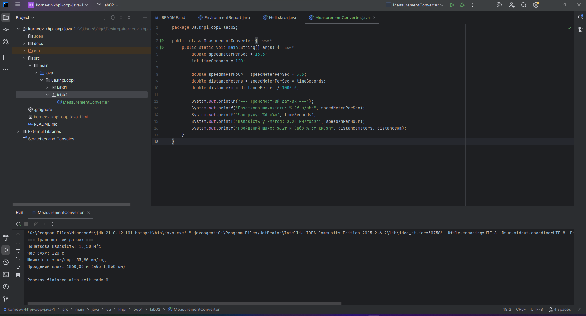
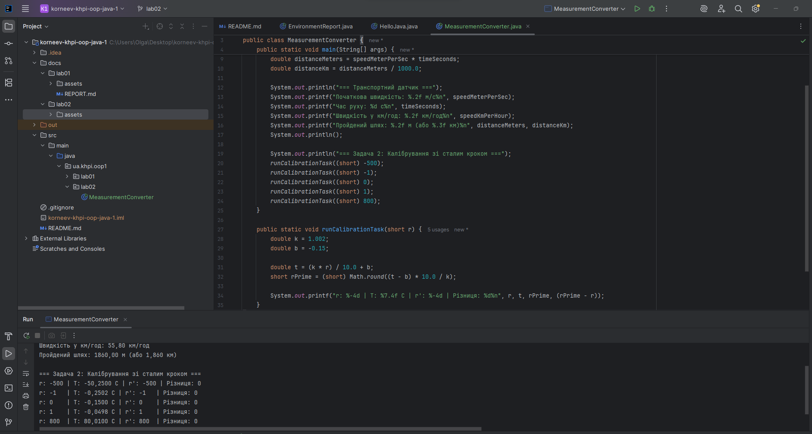
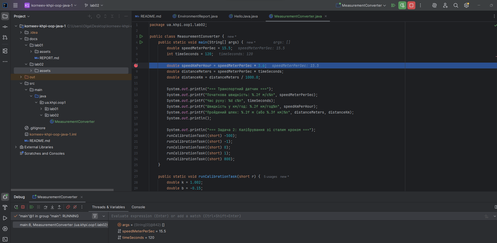

# Звіт з лабораторної роботи № 2

**Тема:** Типи даних, літерали та перетворення
**Виконав:** Корнєєв Кирилл, група КН-1025
**Варіант:** 2

## Мета
Побудова відтворюваної Java-програми для перетворення інженерних величин із обґрунтованим вибором примітивних типів[cite: 1].

## Варіант (опис завдання)
Перетворити метри за секунду в кілометри за годину та обчислити шлях за заданий час[cite: 1].
Алгоритмічна задача 2: Калібрування зі сталим кроком[cite: 1].

## Результати роботи програми
Програма успішно обчислює швидкість та пройдений шлях, а також виконує алгоритмічне калібрування без використання передчасного цілочисельного ділення.

## Налагодження (Debug)
У процесі налагодження було перевірено значення змінних до виконання першого арифметичного виразу[cite: 1].

## Висновки
Під час виконання лабораторної роботи було побудовано відтворювану Java-програму для перетворення інженерних величин[cite: 1]. Було здійснено обґрунтований вибір примітивних типів: для швидкості та відстані використано дійсний тип `double`, а для часу — цілочисельний тип `int`[cite: 1].

У процесі розробки та виконання алгоритмічної задачі засвоєно:
* Правила неявного розширення типів (під час множення `int` на `double` проміжний результат автоматично стає `double`)[cite: 1].
* Особливості явного звуження типів (наприклад, використання `(short) Math.round(...)` для відновлення коду)[cite: 1].
* Контроль ризиків цілочисельного ділення: для уникнення втрати точності (відкидання дробової частини) при діленні використовувалися дійсні літерали, такі як `1000.0` та `10.0`[cite: 1].

Також було успішно застосовано режим налагодження (Debug) для покрокового контролю проміжних значень змінних та закріплено навички роботи з системою контролю версій Git (створення ізольованої гілки `lab02`)[cite: 1].